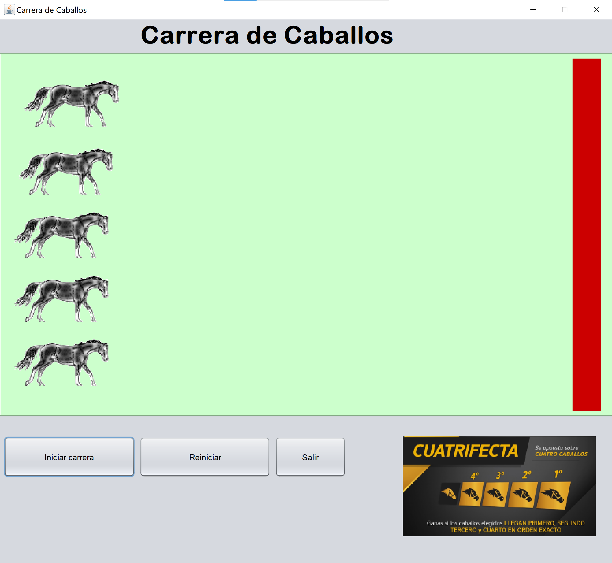
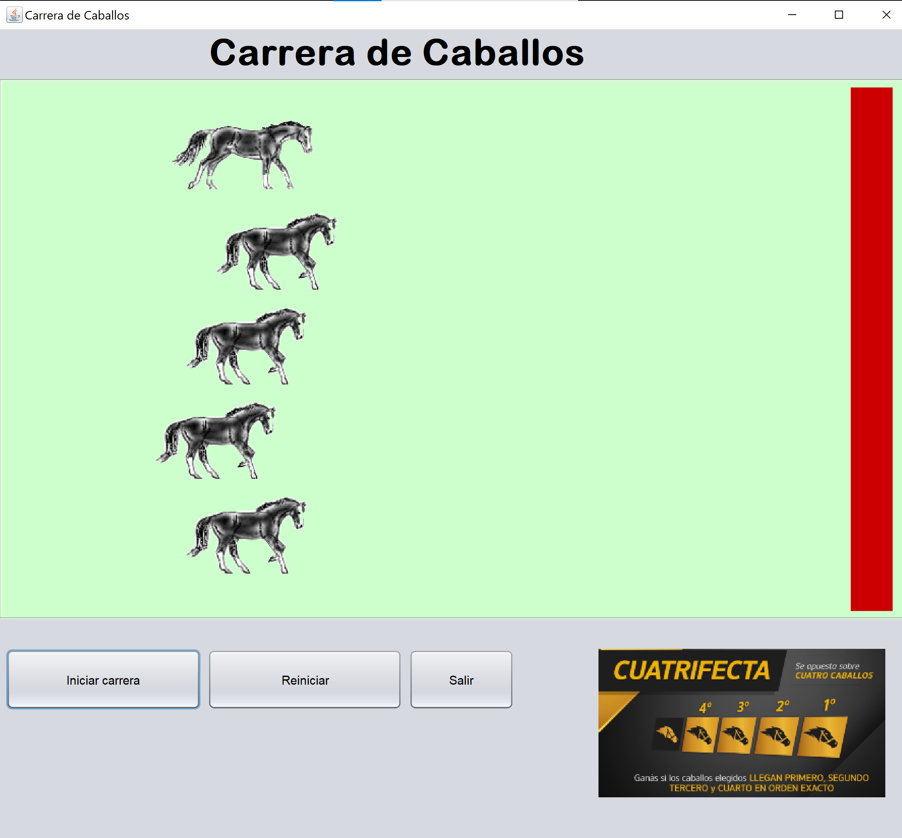
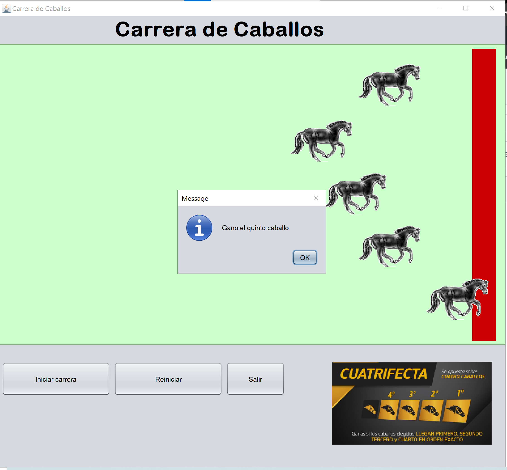

# Welcome to My First Java Project

This project is a little application where I use threads and add images to labels. I place these in a thread in a random position, allowing you to see the label move toward  the goal, developed in Java using NetBeans.

## Features

- **Start Button**
- **You can see you a lot hourses move in a random direction with threads until the goal**

## Getting Started

### Prerequisites
- Java Development Kit (JDK)
- NetBeans IDE
## Project images

  
  

